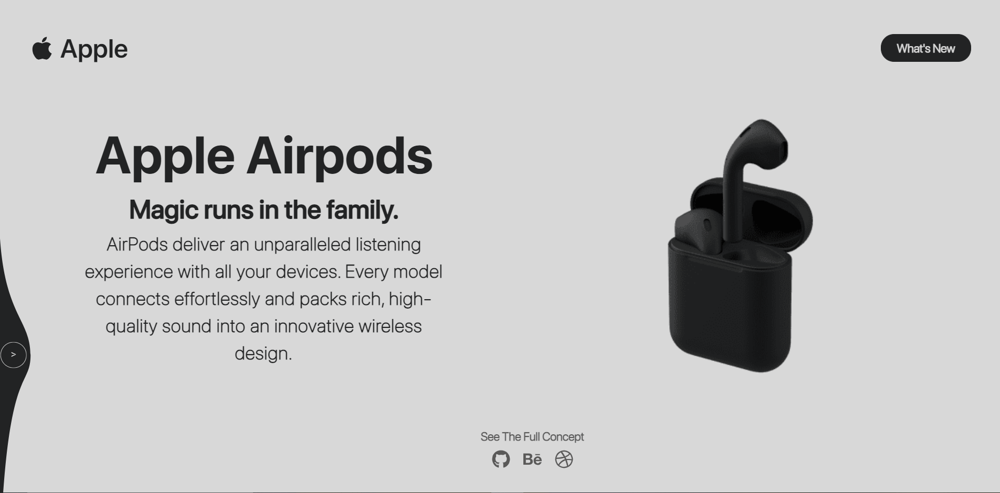

<h1 align="center"> SwipeFlow</h1> 
<h3 align="center"> Very smooth component transition animation with swipe flow effect. </h3>


<p align="center"> 
    <a href="https://liquidswipe.netlify.app/" target="_blank">
    </img>
  </a>
</p>

:star: Star us on GitHub — it helps!  
**React LiquidSwipe** is created using physics based animation libraries `react-spring` and `react-use-gesture`.

# Use in your website

Liquid swipe effect is created considering reusability in mind. As of now, there is no `npm` or `yarn` package that you can install because there are several major issues with this package and they are mentioned in the later section of this file. Once, those errors are addressed, we can wrap the component as `npm` or `yarn` package.

If you want to use this animation in your website, you can clone the repository and you can copy the file `src/components/liquidswipe.js` in your project.

To use the component, your code should look like below.

```javascript
import { LiquidSwipe } from '<relative-path-of-liquidswipe.js>';
...
export const YourComponent = () => {
    var componentsToRender = [] // Add components you want to render.
    var backgroundColors = [] // Add background colors for each component.
    ...
    return (
        ...
        <LiquidSwipe
            components={componentsToRender}
            colors={backgroundColors}
        />
        ...
    );
}
```

As of now, the mass and tension of the animation drag is constant and is defined in `liquidswipe.js` file but it may be a changeable parameter in the future version.

# Technologies Used 

- [GatsbyJS](https://www.gatsbyjs.com/)
- [React Spring](https://www.react-spring.io/)
- [React UseGesture](https://use-gesture.netlify.app/)
- [Styled Components](https://styled-components.com/)
- [Prettier](https://prettier.io/)
- [Theme UI](https://theme-ui.com/)
- [React Icons](https://react-icons.github.io/react-icons/)


# Caution

This project is still under development and has many issues with it. We have only achieved animation. We need to handle the side effects which it has generated. So, I would humbly suggest you not to use this animation in below cases.

- The animation uses dynamic rendering. So, globally rendered background colors by any theming library (styled-components, emotion, theme-ui) will not work. You can use theming libraries for all purposes other than changing colors.
- Currently it is not working in mobile and tablet screens since click is not available and tap animation code has to be added.

If you think you can solve any of the above problems then we will highly appreciate you to raise the pull request.


# References 

- [Cuberto Design Agency has created an original design concept](https://dribbble.com/shots/10680562-UI-Design-Course-3-Liquid-Swipe-After-Effects-Animation-2020)
- [React Native implementation by William Candillon](https://www.youtube.com/watch?v=gLopy2MCAqM)
- [A codepen by Yugam](https://codepen.io/pizza3/pen/LYGQOBo)
